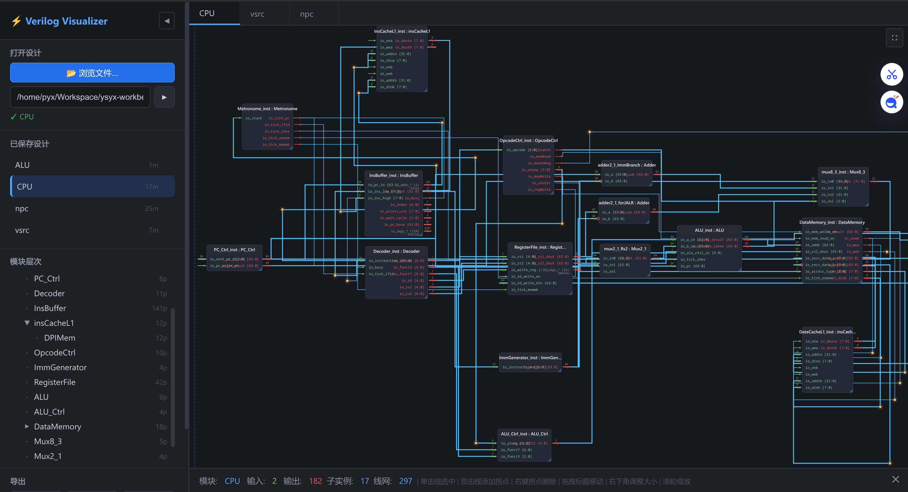
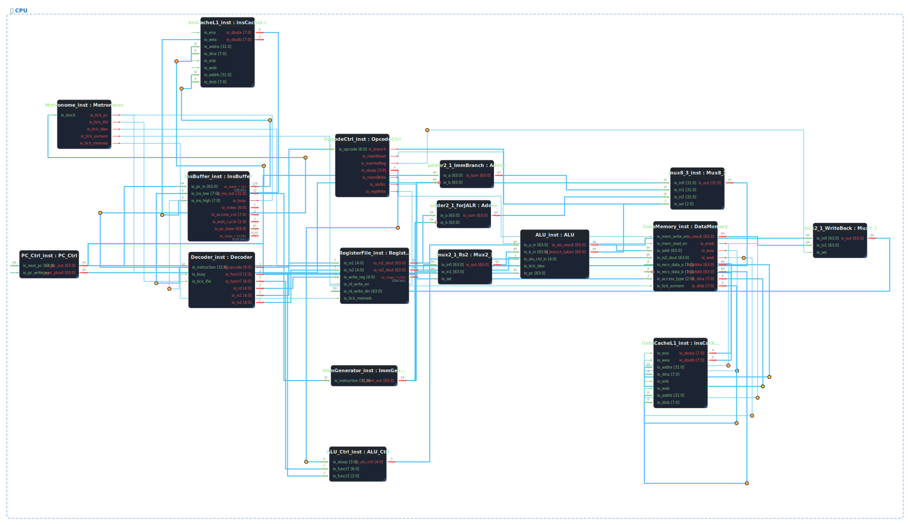

# ⚡ VerilogVisualization

An interactive, browser-based Verilog module hierarchy visualizer.  
Designed for Chisel-generated RTL and hand-written Verilog — parse a single `.v` file or an entire folder, explore the module tree, trace signals, and export diagrams.



---

## ✨ Features

| Feature | Description |
|---|---|
| 📂 **File / Folder Analysis** | Parse a single `.v` file or a whole folder; automatically identifies the top-level module |
| 🔍 **Auto Sibling Search** | When parsing a single file, missing module definitions are searched in sibling `.v` files automatically |
| 🌲 **Module Hierarchy Tree** | Collapsible sidebar tree; single-click **navigates & highlights** the instance on the canvas |
| 🔎 **Module Search** | Search box in the module tree to quickly locate any module by name |
| 📐 **Interactive Canvas** | Pan (drag), zoom (scroll), fit-to-view; move modules by dragging the header |
| 🔌 **Signal Wires** | Click a wire to **select & highlight** it; double-click to add routing waypoints; right-click waypoints to delete |
| 🚦 **Port Stubs & Arrows** | Input/output arrows on every port; active-low ports marked with a circle |
| 📦 **Port Collapsing** | Common-prefix port groups collapsed by default to reduce clutter; expandable on click |
| 🕐 **Clock/Reset Toggle** | Hide/show clock and reset pins + their wires with one button |
| 💾 **Layout Persistence** | Module positions, wire waypoints, and pan/zoom saved to `localStorage` per design |
| 📤 **Export** | Export the dashed bounding-box content as **SVG**, **PNG** (2× HiDPI), or **HTML** |
| 🗂️ **Multi-tab** | Open multiple designs simultaneously in separate tabs |
| ↔️ **Collapsible Sidebar** | Sidebar can be collapsed to maximise canvas space; fullscreen mode available |

---

## 📸 Screenshots

### Module hierarchy with wires and port stubs


---

## 🚀 Quick Start

### Requirements
- Python 3.8+
- A modern browser (Chrome / Firefox / Edge)

### One-command setup & launch

```bash
git clone https://github.com/<your-username>/VerilogVisualization.git
cd VerilogVisualization
bash setup.sh
```

The script will:
1. Detect your Python interpreter (3.8+)
2. Create a `.venv` virtual environment
3. Install `flask` from `requirements.txt`
4. Start the server at **http://127.0.0.1:5000** and open your browser

---

## 🗂️ Project Structure

```
VerilogVisualization/
├── setup.sh              ← One-click setup + launch
├── start.sh              ← Re-launch (assumes .venv already exists)
├── requirements.txt      ← Python deps (flask)
├── data/                 ← Auto-generated design JSON cache
├── img/                  ← Screenshots / demo images
└── src/
    ├── app.py            ← Flask backend (API endpoints, export)
    ├── verilog_parser.py ← Verilog parser (modules, ports, instances, assigns)
    ├── templates/
    │   └── index.html    ← Single-page app shell
    └── static/
        ├── renderer.js   ← SVG rendering engine (layout, wires, port stubs)
        ├── app.js        ← Frontend logic (pan/zoom, drag, export, sidebar)
        └── style.css     ← Dark-theme styles
```

---

## 📖 Usage

1. **Open a design** — click **浏览文件** (Browse) to navigate to a `.v` file or a folder, then confirm to parse.
2. **Explore the tree** — use the left sidebar module tree; single-click any module to jump to it on the canvas; double-click expandable modules to reveal/hide their internals.
3. **Search** — type in the search box above the module tree to filter by name.
4. **Navigate** — scroll to zoom, drag the background to pan, or click **适应窗口** (Fit View).
5. **Wires** — click a wire to highlight it and show source/destination in the info bar; double-click to add routing waypoints.
6. **Clock/Reset** — toggle the **🕐 显示时钟/复位** button to hide/show all clock and reset pins and their wires.
7. **Export** — click **SVG**, **PNG**, or **HTML** to download the current diagram (exports only the dashed bounding-box region, regardless of current pan/zoom).
8. **Fullscreen / Collapse** — use **⛶** for fullscreen, **◀/▶** to collapse/expand the sidebar.

---

## ⚙️ API Endpoints (backend)

| Method | Endpoint | Description |
|---|---|---|
| GET | `/` | Main UI |
| POST | `/api/browse` | Filesystem browser |
| POST | `/api/analyze` | Parse Verilog file or folder |
| GET | `/api/designs` | List saved designs |
| GET | `/api/design/<name>` | Get design data |
| DELETE | `/api/delete/<name>` | Delete a design |
| POST | `/api/export_svg` | Download SVG |
| POST | `/api/export_html` | Download HTML |

---

## 📝 License

MIT
